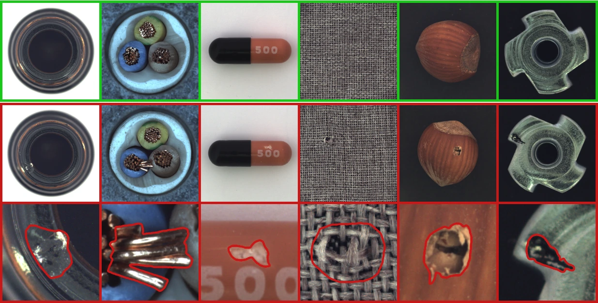
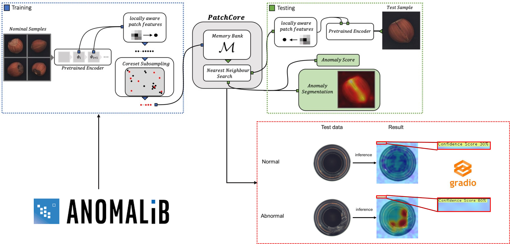
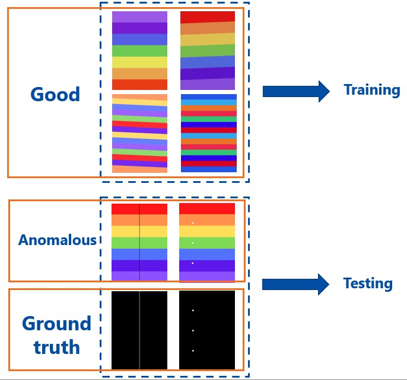
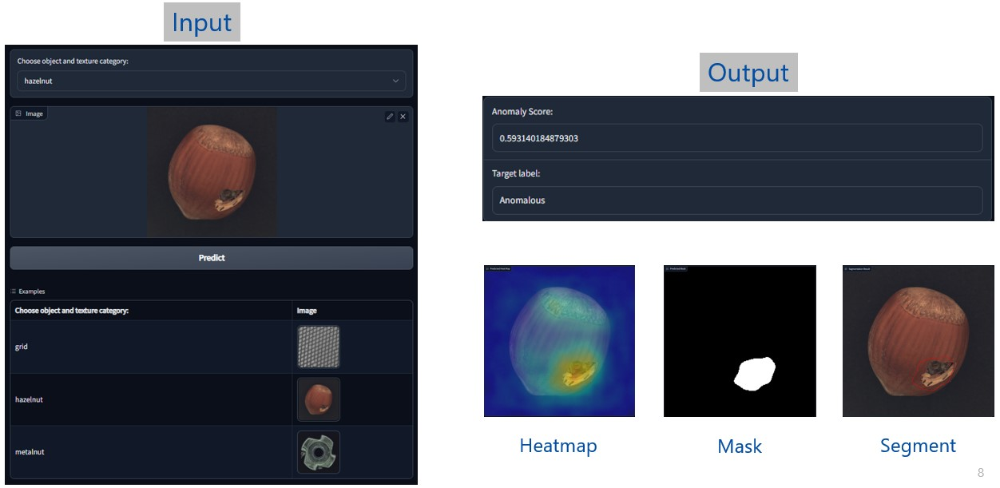
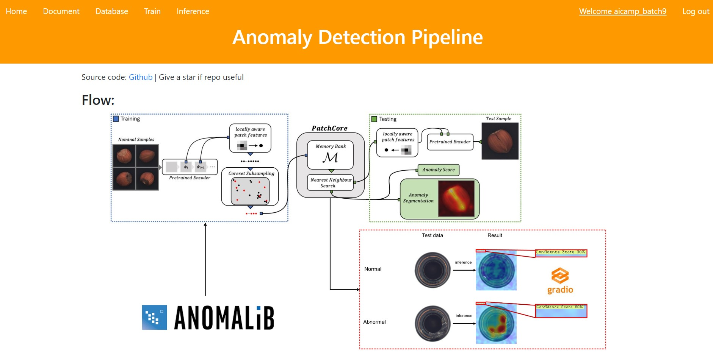
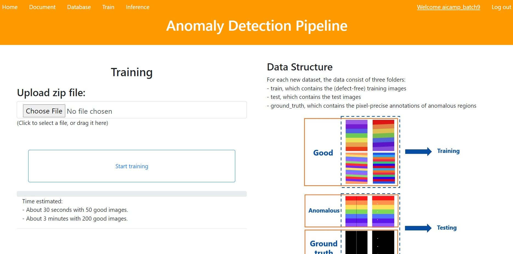
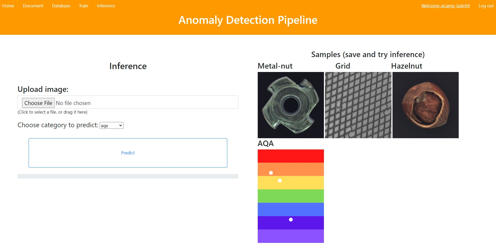
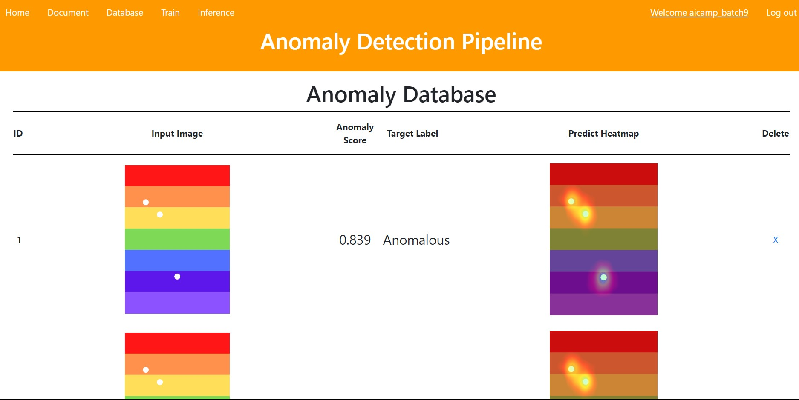

# Anomaly Detection in Industry Manufacturing

## Anomalib Contributor
Folder: anomalib_contribute
Link: https://github.com/openvinotoolkit/anomalib#1-web-based-pipeline-for-training-and-inference

## Dataset
THE MVTEC ANOMALY DETECTION DATASET (MVTEC AD)

MVTec AD is a dataset for benchmarking anomaly detection methods with a focus on industrial inspection. It contains over 5000 high-resolution images divided into fifteen different object and texture categories. Each category comprises a set of defect-free training images and a test set of images with various kinds of defects as well as images without defects.


Link dataset: <u>https://www.mvtec.com/company/research/datasets/mvtec-ad</u>

## Install packages
```
conda create -n anomaly-detection python=3.8
conda activate anomaly-detection
pip install -r requirements.txt
```
## Flow


## Custom dataset
For each new dataset, the data consist of three folders:
- train, which contains the (defect-free) training images
- test, which contains the test images
- ground_truth, which contains the pixel-precise annotations of anomalous regions


## Train
```
python train.py --config "configs/patchcore_grid.yaml" --model "patchcore"
```

or download pretrained models
```
bash download_pretrained.sh
```

## Evaluation (Coming soon)
## Inference
```
python script_inference.py --config "configs/patchcore_hazelnut.yaml" --weight "models/patchcore_hazelnut.ckpt" --image "samples/007_hazelnut.png"
```
or just simple:
```
python script_inference.py
```
## App 
### Gradio
```
python demo.py
```
Open local URL: http://127.0.0.1:7860

Sample:


### Flask
```
python app.py
```
Open local URL: http://127.0.0.1:5000

Default account login:
- Username: aicamp_batch9
- Password: 123456

Homepage:


Train:


Inference:


Database:


## Container
```
docker build -t anomaly:v1 .
docker run anomaly:v1
```

or just simple

```
docker-compose up
```
## Deploy AWS
First: Create EC2 instance 

Second: git clone and install related packages
```
git clone https://github.com/vnk8071/anomaly-detection-in-industry-manufacturing.git

sh download_pretrained.sh
```
Next: install Miniconda and Docker engine

- Miniconda: Follow link https://varhowto.com/install-miniconda-ubuntu-18-04/
- Docker engine: Follow link https://docs.docker.com/engine/install/ubuntu/

```
docker-compose up
```

Final: access link http://user-IPv4-public-ec2-aws
