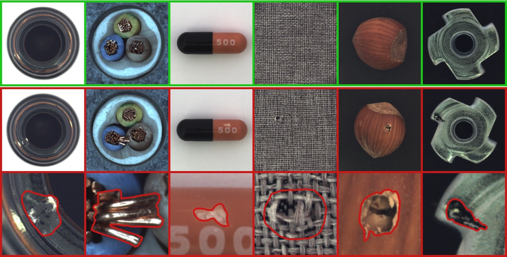
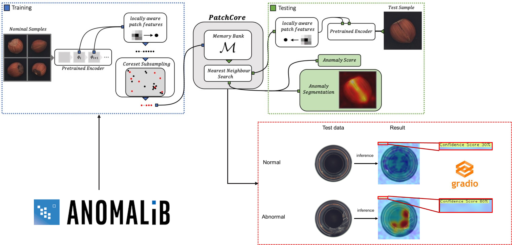
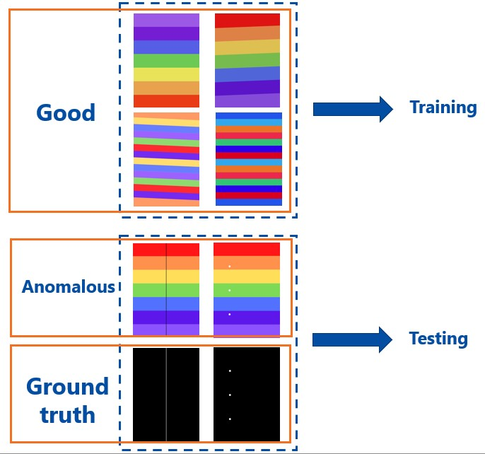
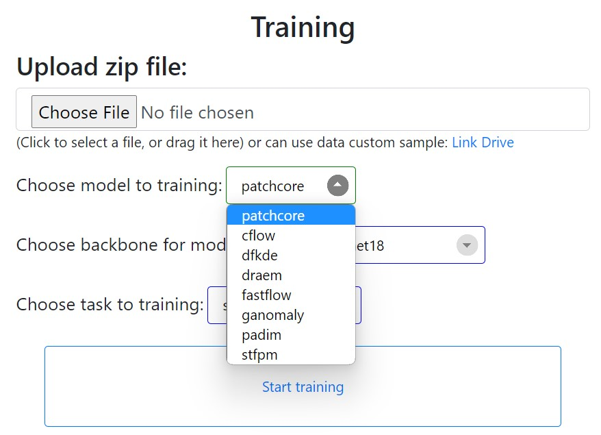
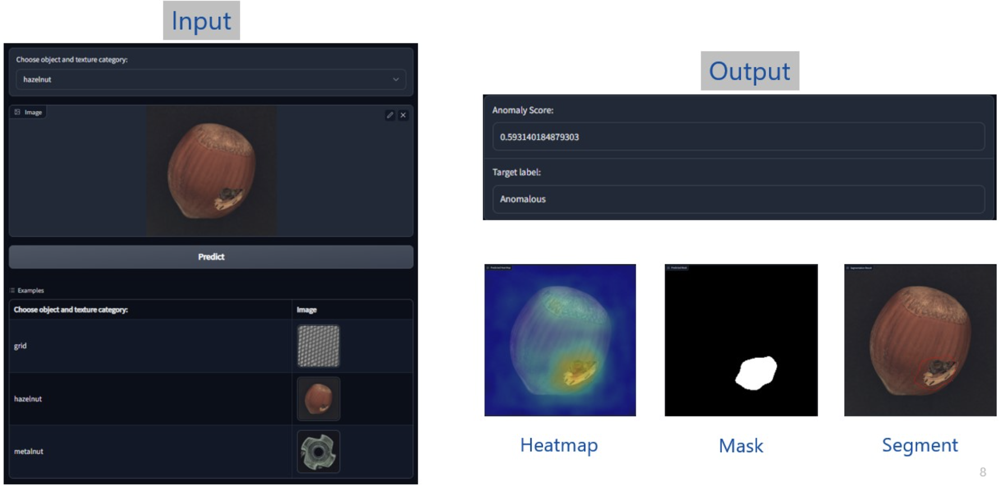
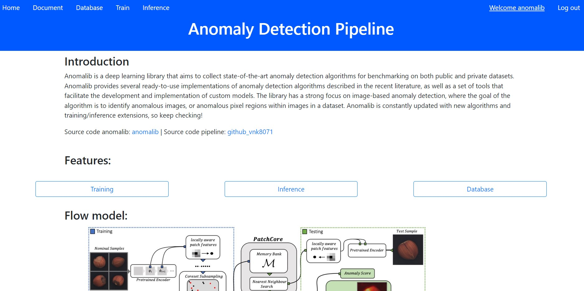
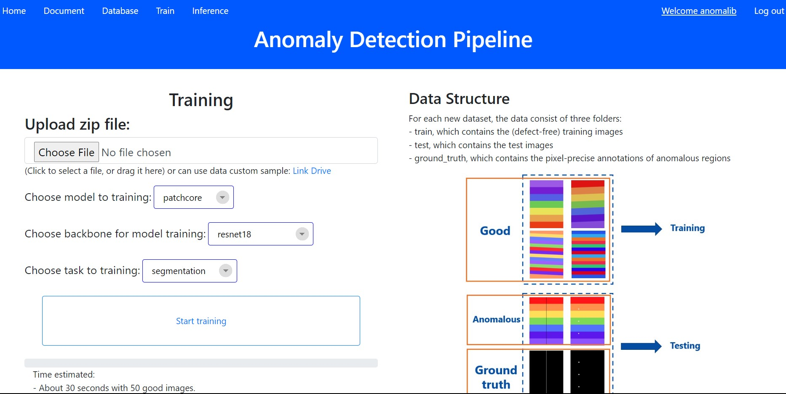
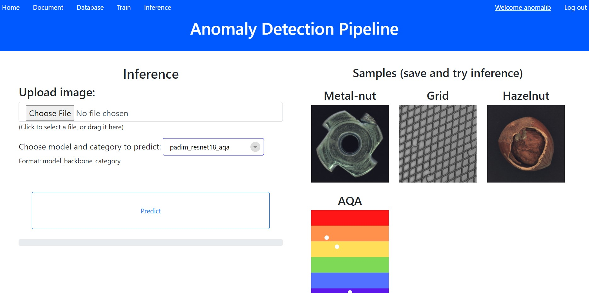

# Anomaly Detection in Industry Manufacturing

## Anomalib Version Note (Legacy vs Current)

- Anomalib Contributor: `anomalib_contribute` folder.
- New Commit: https://github.com/open-edge-platform/anomalib/commit/70fabcdb63620ed77a74c66985afa6c803359c5f
- Deprecated README: https://github.com/openvinotoolkit/anomalib#1-web-based-pipeline-for-training-and-inference

This project was built against the legacy Anomalib API and pins `anomalib==0.3.6`.

- Legacy pins: `anomalib_contribute/requirements.txt`, `deprecated/requirements.txt`

Anomalib has since moved forward significantly (newer releases, updated APIs/CLI, docs). For the maintained upstream project, use:

- Upstream repo (current): <https://github.com/open-edge-platform/anomalib>
- Docs (current): <https://anomalib.readthedocs.io/en/latest/>

Historically, Anomalib was hosted under `openvinotoolkit/anomalib`; it is now maintained at `open-edge-platform/anomalib`.

If you install a newer Anomalib version, expect code/config changes may be required.

## Project Layout

- `anomalib_contribute/`: implementation built on legacy Anomalib
- `deprecated/`: legacy snapshot (see folder for details)

## Dataset

### MVTec Anomaly Detection (MVTec AD)

MVTec AD is a dataset for benchmarking anomaly detection methods with a focus on industrial inspection. It contains over 5000 high-resolution images divided into fifteen different object and texture categories. Each category comprises a set of defect-free training images and a test set of images with various kinds of defects as well as images without defects.



Dataset link: <https://www.mvtec.com/company/research/datasets/mvtec-ad>

## Installation

```bash
conda create -n anomaly-detection python=3.10
conda activate anomaly-detection
pip install -r requirements.txt
```

## Flow



## Custom dataset

For each new dataset, the data consist of three folders:

- train, which contains the (defect-free) training images
- test, which contains the test images
- ground_truth, which contains the pixel-precise annotations of anomalous regions



## Hardware

```text
GPU available: True (mps), used: True
TPU available: False, using: 0 TPU cores

┏━━━┳━━━━━━━━━━━━━━━━┳━━━━━━━━━━━━━━━━┳━━━━━━━━┳━━━━━━━┳━━━━━━━┓
┃   ┃ Name           ┃ Type           ┃ Params ┃ Mode  ┃ FLOPs ┃
┡━━━╇━━━━━━━━━━━━━━━━╇━━━━━━━━━━━━━━━━╇━━━━━━━━╇━━━━━━━╇━━━━━━━┩
│ 0 │ pre_processor  │ PreProcessor   │      0 │ train │     0 │
│ 1 │ post_processor │ PostProcessor  │      0 │ train │     0 │
│ 2 │ evaluator      │ Evaluator      │      0 │ train │     0 │
│ 3 │ model          │ PatchcoreModel │  2.8 M │ train │     0 │
└───┴────────────────┴────────────────┴────────┴───────┴───────┘
Trainable params: 2.8 M
Non-trainable params: 0
Total params: 2.8 M
Total estimated model params size (MB): 11
Modules in train mode: 19
Modules in eval mode: 69
Total FLOPs: 0
```

## Models



## Train

```bash
python train.py --config "configs/patchcore_grid.yaml" --model "patchcore"
```

## Evaluation (Coming soon)

## Inference

```bash
python script_inference.py --config "configs/patchcore_hazelnut.yaml" --weight "models/patchcore_hazelnut.ckpt" --image "samples/007_hazelnut.png"
```

Or (simple default):

```bash
python script_inference.py
```

## Benchmark (PyTorch vs ONNXRuntime vs OpenVINO)

Run:

```bash
python benchmark.py \
  --image static/aqa.png \
  --torch-model models/patchcore_resnet18_aqa.pt \
  --onnx-model models/patchcore_resnet18_aqa.onnx \
  --warmup 5 --runs 50 \
  --onnx-compare-coreml \
  --openvino-compare-int8 \
  --openvino-int8-model models/openvino_int8/patchcore_resnet18_aqa/model.xml \
  --trust-remote-code
```

Sample results (image=`static/aqa.png`, warmup=5, runs=50):

| Backend | FPS | Mean (ms) | P50 (ms) | P95 (ms) | P99 (ms) | Min (ms) | Max (ms) |
| --- | ---: | ---: | ---: | ---: | ---: | ---: | ---: |
| PyTorch (`TorchInferencer`) | 15.49 | 64.55 | 63.66 | 72.58 | 77.41 | 59.84 | 81.41 |
| ONNXRuntime (CoreML EP) | 24.43 | 40.93 | 40.93 | 41.63 | 42.71 | 39.80 | 43.19 |
| ONNXRuntime (CPU) | 20.62 | 48.50 | 48.31 | 50.70 | 51.46 | 46.34 | 51.53 |
| OpenVINO (`AUTO`, FP32) | 20.67 | 48.38 | 48.11 | 52.14 | 56.29 | 44.51 | 58.21 |
| OpenVINO (`AUTO`, INT8) | 21.66 | 46.16 | 45.40 | 50.53 | 53.06 | 44.20 | 54.33 |

## ONNX INT8 Quantization (Static)

Static INT8 quantization uses a calibration set of representative images:

```bash
python quantize_onnx_static.py \
  --onnx models/patchcore_resnet18_aqa.onnx \
  --out models/patchcore_resnet18_aqa.int8.onnx \
  --calib-dir <path-to-calibration-images> \
  --num-samples 200 \
  --input-size 224
```

## OpenVINO INT8 Quantization (PTQ)

Recommended for OpenVINO instead of importing an INT8 QDQ ONNX graph:

```bash
python quantize_openvino_int8.py \
  --onnx models/patchcore_resnet18_aqa.onnx \
  --out-dir models/openvino_int8/patchcore_resnet18_aqa \
  --calib-dir <path-to-calibration-images> \
  --num-samples 200 \
  --input-size 224
```

Then run inference with the generated OpenVINO IR:

```bash
python inference.py \
  --backend openvino \
  --openvino-device AUTO \
  --model models/openvino_int8/patchcore_resnet18_aqa/model.xml \
  --image static/aqa.png
```


## App

### Gradio

```bash
python demo.py
```

Open local URL: http://127.0.0.1:7860

Sample:



### FastAPI

```bash
python app.py
```

Open local URL: http://127.0.0.1:8000

Homepage:


Train:


Inference:


## Container

```bash
docker build -t anomaly:v1 .
docker run anomaly:v1
```

Or:

```bash
docker-compose up
```
